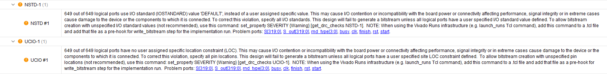
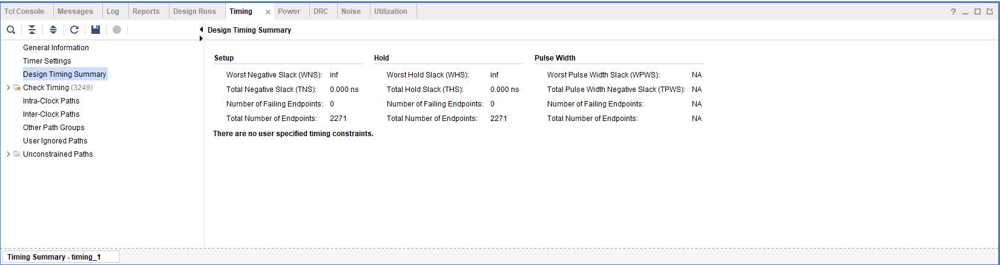
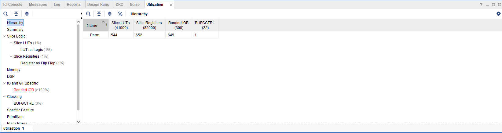
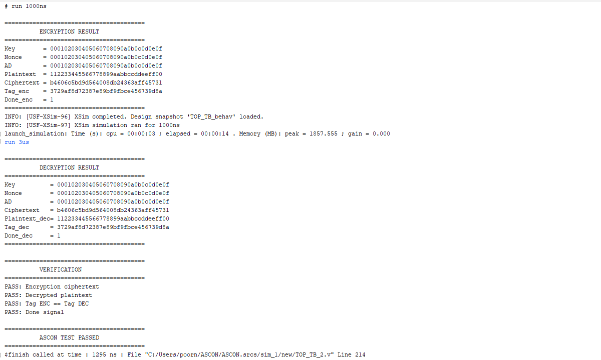
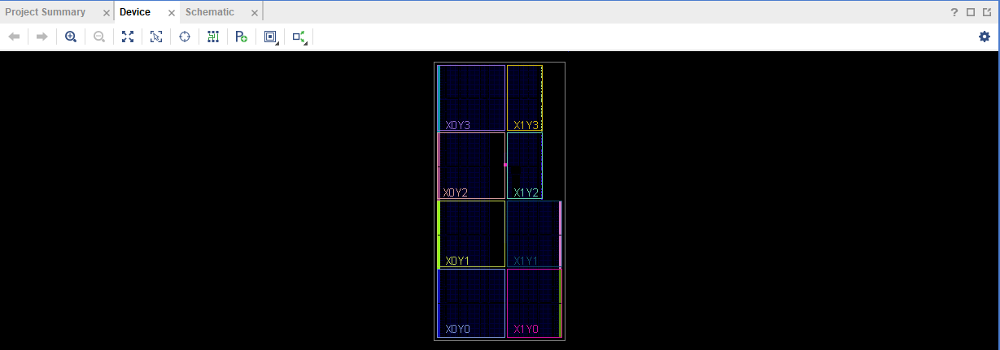
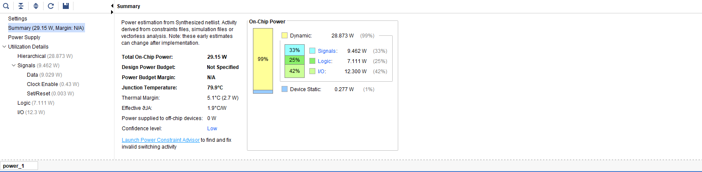

# ASCON-AEAD128 — FPGA Hardware Implementation

**RTL implementation of ASCON-AEAD128 in Verilog, verified in AMD/Xilinx Vivado and taken through initial FPGA synthesis.**

> Lightweight authenticated encryption for resource-constrained embedded and real-time systems.

## Current Status

| Stage | Status |
|---|---|
| ASCON permutation | ✅ |
| S-box / nonlinear layer | ✅ |
| Linear diffusion | ✅ |
| Round constants & counter | ✅ |
| Initialization | ✅ |
| Associated Data processing | ✅ |
| Plaintext / Ciphertext processing | ✅ |
| Finalization & Tag | ✅ |
| Encryption verification | ✅ |
| Decryption verification | ✅ |
| Vivado synthesis | ✅ |
| Timing constraints | ⏳ |
| FPGA implementation / bitstream | ⏳ |
| Hardware validation | ⏳ |

---

## Architecture

The design processes the ASCON 320-bit state through modular RTL stages:

```text
                     START
                       │
                       ▼
              ┌─────────────────┐
              │ Initialization  │
              └────────┬────────┘
                       ▼
              ┌─────────────────┐
              │ Associated Data │
              └────────┬────────┘
                       ▼
              ┌─────────────────┐
              │ PT / CT Process │
              └────────┬────────┘
                       ▼
              ┌─────────────────┐
              │ Finalization +  │
              │ Tag Generation  │
              └────────┬────────┘
                       ▼
                     DONE
```

The permutation operates on five 64-bit words:

```text
┌──────┬──────┬──────┬──────┬──────┐
│  X0  │  X1  │  X2  │  X3  │  X4  │  = 320 bits
└──────┴──────┴──────┴──────┴──────┘
    │
    ▼
Round Constant → S-Box → Linear Diffusion → Next State
```

### RTL Blocks

`TOP.v` · `initialization.v` · `AD_Processing.v` · `PT_CT.v` · `Final_layer.v` · `Perm.v` · `SBox.v` · `Linear_Sub.v` · `RND_Const.v` · `RND_COUNTER.v`

---

## Functional Verification

The current Vivado XSim testbench verifies both encryption and decryption.

### Test Vector

```text
Key       = 000102030405060708090a0b0c0d0e0f
Nonce     = 000102030405060708090a0b0c0d0e0f
AD        = 000102030405060708090a0b0c0d0e0f
Plaintext = 112233445566778899aabbccddeeff00

AD length   = 128 bits
Text length = 128 bits
```

### Encryption

```text
Ciphertext = b4606c5bd9d564008db24363aff45731
Tag        = 3729af8d72387e89bf9fbce456739d8a
```

### Decryption

```text
Plaintext  = 112233445566778899aabbccddeeff00
Tag        = 3729af8d72387e89bf9fbce456739d8a
```

### Automated Checks

```text
PASS: Encryption ciphertext
PASS: Decrypted plaintext
PASS: Tag ENC == Tag DEC
PASS: Done signal

================================
        ASCON TEST PASSED
================================
```

Simulation completed at **1295 ns**.

### Simulation Waveform


### Simulation Verification



---

## FPGA Synthesis Results

Initial Vivado post-synthesis results:

| Resource | Used | Available | Utilization |
|---|---:|---:|---:|
| Slice LUTs | 544 | 41,000 | ~1% |
| Slice Registers | 652 | 82,000 | ~1% |
| Bonded IOB | 649 | 300 | >100% |
| BUFGCTRL | 1 | 32 | ~3% |

The LUT/register figures are **post-synthesis results**, not final post-implementation numbers.

### Utilization



### Synthesis Warning

Vivado reports `Netlist 29-101` for the `Perm` hierarchy because its synthesized cellview contains a large number of primitives. This is an implementation/floorplanning warning, not a functional failure.



---

## Timing

The current report shows:

```text
WNS = inf
TNS = 0.000 ns
WHS = inf
THS = 0.000 ns
Failing endpoints = 0
Total endpoints = 2271
```

However, Vivado explicitly reports:

```text
There are no user specified timing constraints.
```

Therefore, **no Fmax or timing-closure claim is made at this stage**. A clock constraint and post-implementation timing analysis are required before reporting operating frequency.



---

## Power

Current Vivado synthesis-level estimate:

| Parameter | Result |
|---|---:|
| Total On-Chip Power | 29.15 W |
| Dynamic Power | 28.873 W |
| Static Power | 0.277 W |
| Junction Temperature | 79.9 °C |
| Thermal Margin | 5.1 °C |
| Confidence | Low |

The 29.15 W value is a **preliminary low-confidence estimate, not measured hardware power**. The current wide top-level interface also contributes substantially to estimated I/O power.



---

## FPGA I/O Integration

The current verification-oriented `TOP` exposes wide 1024-bit data buses directly as top-level ports, resulting in:

```text
649 logical I/O ports
300 available bonded IOBs
```

Vivado consequently reports:

```text
NSTD-1 : IOSTANDARD = DEFAULT
UCIO-1 : ports without LOC constraints
```

These are expected to be addressed during board-level integration.

The planned hardware architecture is:

```text
PC / Host
    │
 UART / AXI / BRAM
    │
    ▼
┌─────────────────────┐
│ FPGA Interface      │
│ Wrapper             │
└──────────┬──────────┘
           │
           ▼
┌─────────────────────┐
│ ASCON Core          │
│ 320-bit State       │
│ Permutation         │
│ AD / PT-CT / Final  │
└──────────┬──────────┘
           │
           ▼
        Result + Tag
```

The wide cryptographic datapath will remain internal to the FPGA rather than being mapped directly to package pins.



---

## Development Roadmap

```text
[x] RTL cryptographic core
[x] Encryption / decryption simulation
[x] End-to-end verification
[x] Vivado synthesis
[ ] Clock and I/O constraints
[ ] FPGA implementation
[ ] Timing closure
[ ] Bitstream generation
[ ] FPGA hardware bring-up
[ ] UART / host interface
[ ] ILA-based debugging
[ ] Throughput and latency characterization
[ ] Hardware power measurement
[ ] Architecture optimization
```

Future optimization will investigate the area/throughput trade-off of iterative, partially unrolled, and pipelined permutation architectures.

---

## Repository Structure

```text
Ascon_Cipher/
├── RTL/
├── Simulation/
├── Results/
│   ├── Simulation/
│   └── Synthesis/
├── Constraints/
├── README.md
└── LICENSE
```

---

## Tools

**Verilog HDL · AMD/Xilinx Vivado · Vivado XSim · FPGA RTL Design · Lightweight Cryptography · Authenticated Encryption · FPGA Synthesis**

---

## Author

**Poorna Sai Reddy**  
B.Tech — Electrical Engineering, IIT Indore

